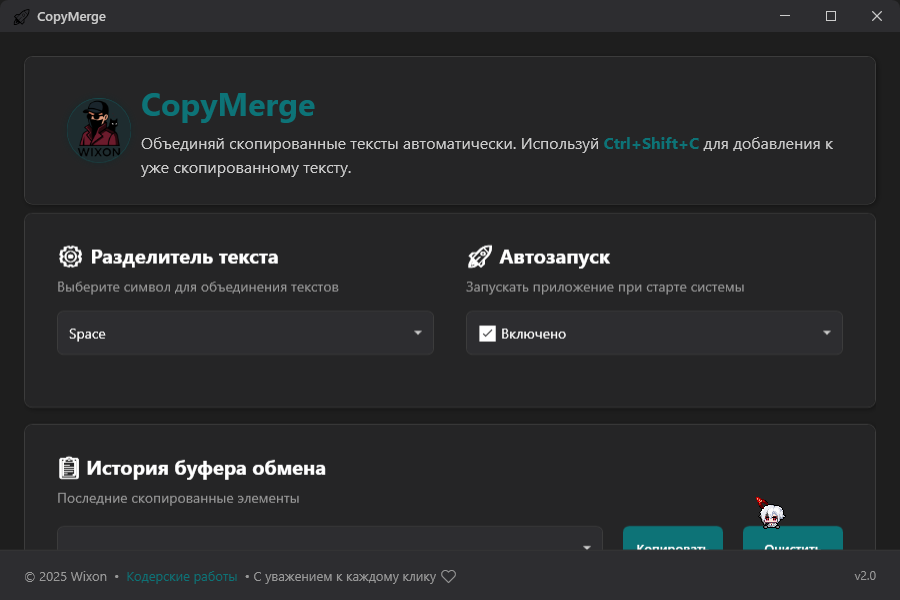
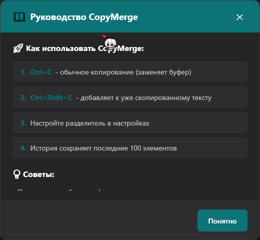

# 🚀 CopyMerge

<div align="center">


**Умное объединение скопированного текста одной горячей клавишей**

[](https://github.com/yourusername/copymerge/releases)
[](LICENSE)
[]()
[]()

</div>

---

## ✨ **О проекте**

CopyMerge решает простую, но назойливую проблему: **как быстро объединить несколько скопированных фрагментов текста?** 

Вместо переключения между приложениями и ручной склейки текста, просто используйте **`Ctrl+Shift+C`** для добавления нового текста к уже скопированному!

### 🎯 **Для кого это?**

<table>
<tr>
<td align="center">🎓<br><b>Студенты</b><br>Сбор цитат</td>
<td align="center">✍️<br><b>Копирайтеры</b><br>Объединение текстовых блоков</td>
<td align="center">👨‍💻<br><b>Разработчики</b><br>Сбор кода</td>
<td align="center">🌐<br><b>Переводчики</b><br>Накопление переводов</td>
</tr>
</table>

---

## 🚀 **Ключевые возможности**

<div align="center">

| Функция | Описание | Горячая клавиша |
|---------|----------|-----------------|
| 📋 **Обычное копирование** | Заменяет содержимое буфера | `Ctrl+C` |
| ➕ **Умное объединение** | Добавляет к существующему тексту | `Ctrl+Shift+C` |
| 🎨 **Настраиваемые разделители** | Enter, пробел, запятая, точка | - |
| 📚 **История буфера** | Сохраняет последние копирования | - |
| 🌙 **Работа в трее** | Не мешает основной работе | - |
| 🚀 **Автозапуск** | Запускается вместе с Windows | - |

</div>

---

## 🎬 **Демо**

### До CopyMerge:
```
1. Копируешь "Первый текст" → Ctrl+C
2. Переходишь в блокнот
3. Вставляешь → Ctrl+V  
4. Копируешь "Второй текст" → Ctrl+C
5. Возвращаешься в блокнот
6. Добавляешь разделитель и вставляешь...
😫 6 действий!
```

### С CopyMerge:
```
1. Копируешь "Первый текст" → Ctrl+C
2. Копируешь "Второй текст" → Ctrl+Shift+C
3. Вставляешь объединенный результат → Ctrl+V
🎉 3 действия!
```

**Результат:** `Первый текст\nВторой текст`

---

### 📸 Скриншоты

<div align="center">
  
  <p><i>Главное окно с настройками</i></p>

  
  <p><i>Руководство</i></p>
</div>

---

## 📥 **Установка**

1. Перейдите в [Releases](https://github.com/W1xon/CopyMerge/releases)
2. Скачайте `CopyMerge-v2.0.rar`
3. **Обязательно проверьте контрольные суммы** (см. раздел "Безопасность")
4. Запустите установщик
5. Готово! 🎉

---

## 🛡️ **Безопасность**

### ⚠️ **Важное предупреждение**

CopyMerge отслеживает нажатия горячих клавиш (`Ctrl+C`, `Ctrl+Shift+C`) для своей работы. **Некоторые антивирусы могут расценить это как подозрительную активность** и выдать предупреждение.

### 🔒 **Почему это безопасно?**

- ✅ **Открытый исходный код** - весь код доступен для проверки
- ✅ **Локальная работа** - данные не передаются в интернет
- ✅ **Минимальные права** - отслеживаются только определенные комбинации
- ✅ **Прозрачность** - никаких скрытых функций

### 🚨 **Что делать с предупреждениями антивируса?**

1. **Проверьте контрольные суммы** - убедитесь, что файл не поврежден
2. **Добавьте в исключения** - если суммы совпадают, добавьте CopyMerge в белый список антивируса


## 🛠 **Технические детали**

<details>
<summary><b>Горячие клавиши</b></summary>

| Комбинация | Действие |
|------------|----------|
| `Ctrl+C` | Обычное копирование (замена) |
| `Ctrl+Shift+C` | Умное копирование (добавление) |
| `Ctrl+V` | Вставка объединенного текста |

</details>

## 📞 **Контакты и поддержка**

<div align="center">

**Нужна помощь или есть вопросы?**

[](https://t.me/CoderW0rker)

</div>

---

<div align="center">

**Сделано с ❤️ для повышения продуктивности**

⭐ **Поставьте звезду, если проект оказался полезным!**

</div>